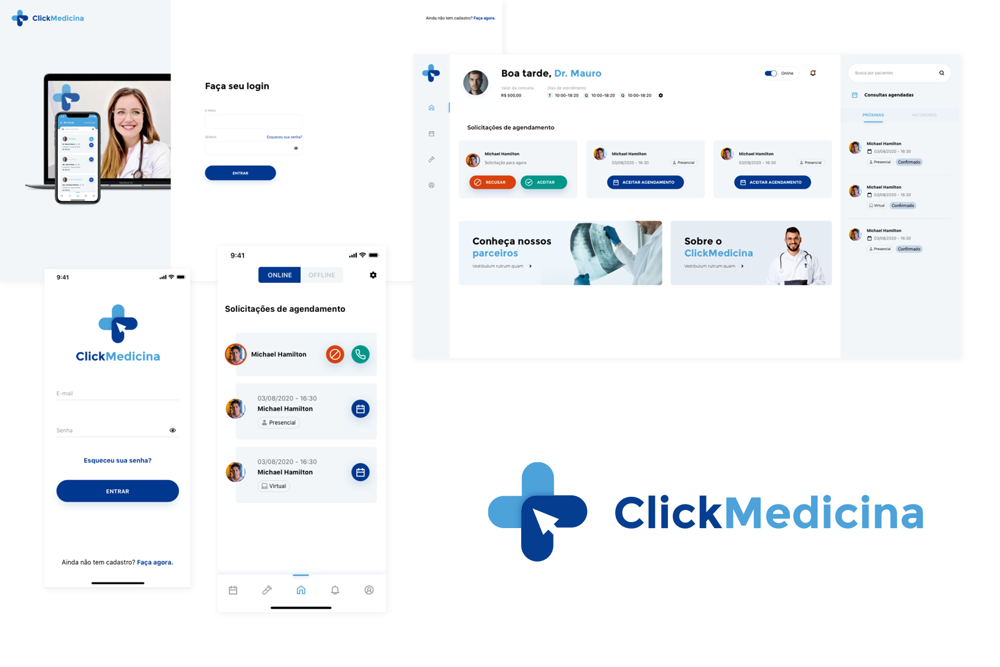

    <h2>Projeto POC - Clickmedicina</h2>

    Projeto desenvolvido com o objetivo de apresentar uma versão POC para a empresa Clickmedicina, cujo objetivo era criar um sistema de tele atendimento voltado para a área da saúde.

## 🚀 Tecnologias 

- **Framework**: 
    - Angular 11.1
    - IONIC 5.5
    - Typescript
    - SCSS

---

Made with 🧡 by Jaqueline Peixer :wave: 

    
    

